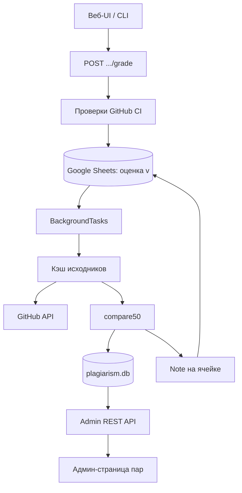
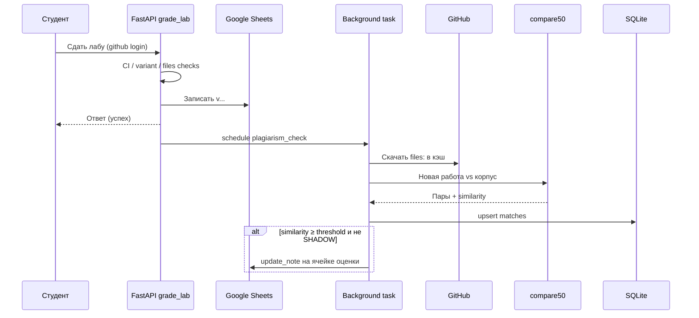

# Отчёт по индивидуальному заданию практики  
## Автоматическая проверка студенческих работ на плагиат в системе lab_grader_web

---

## 1. Описание предметной области

Система **lab_grader_web** предназначена для автоматической проверки лабораторных работ студентов технических специальностей. Типовой сценарий:

1. студент размещает решение в репозитории GitHub организации курса;
2. GitHub Actions (CI) прогоняет автотесты и статический анализ;
3. студент инициирует сдачу через веб-интерфейс;
4. сервис проверяет наличие репозитория, успешность CI, соответствие варианта задания и записывает результат в **Google Таблицу** курса (`v`, `x`, `v-{n}`, `v@{score}` и т.п.).

Отдельной, но критически важной задачей для преподавателя является **контроль академической честности** — выявление копирования кода между студентами (в том числе между семестрами и потоками).

До начала работы по индивидуальному заданию проверка на плагиат в экосистеме lab-grader выполнялась **вручную** с помощью сервиса **MOSS** (Measure Of Software Similarity, Stanford University):

- конфигурация `moss:` уже присутствовала в YAML-описаниях курсов, но в актуальном коде веб-сервиса **не использовалась**;
- MOSS рассчитан на **пакетную** (batch) отправку всего корпуса работ на внешние серверы;
- на практике проверка проводилась в конце семестра, когда все работы уже сданы.

Такой режим не позволяет оперативно реагировать на подозрительные совпадения в момент приёма работы и создаёт зависимость от внешнего сервиса (очереди, квоты, необходимость сети до Stanford).

Предметная область индивидуального задания — **встраивание локальной инкрементальной проверки на плагиат** в существующий контур автопроверки: при успешной простановке оценки сравнивать новую работу с накопленным корпусом и уведомлять преподавателя без изменения самой оценки.

---

## 2. Перечень задач, решаемых в рамках практики

В рамках практики решались следующие задачи:

1. **Анализ** текущего процесса проверки на плагиат (MOSS) и ограничений batch-модели.
2. **Сравнение** локальных инструментов детекции сходства исходного кода: compare50, JPlag (и обзор Dolos) с учётом стека Docker (`python:3.12-slim`).
3. **Проектирование** архитектуры: кэш исходников, движок сравнения, хранение результатов, уведомления, админ-интерфейс.
4. **Реализация кэша** файлов студенческих репозиториев (только файлы из конфига лабы; конвертация `.ipynb` → `.py`).
5. **Реализация обёртки** движка compare50 и инкрементального сравнения «новая сдача vs корпус».
6. **Интеграция** в эндпоинт `grade_lab` через `BackgroundTasks` (без блокировки ответа студенту).
7. **Хранение** пар совпадений в SQLite с флагом ручного review преподавателем.
8. **Уведомление** преподавателя о совпадениях выше порога (заметка/note на ячейке Google Sheets).
9. **Админ-API и UI** для просмотра пар и отметки «рассмотрено».
10. **Конфигурация** курсов: секция `plagiarism:` с deprecated-алиасом `moss:`; обновление документации.
11. **Эмпирическая проверка** ограничений Google Drive API (якорь комментария к ячейке Sheets) и видимости notes для роли Reader.
12. **Сравнительный прогон** compare50 и JPlag на реальном корпусе курса ОС; фиксация выбора движка.
13. **Вспомогательный консольный интерфейс** (`scripts/menu.py`) для типовых операций без длинных CLI-команд.
14. **Покрытие** ключевых модулей unit-тестами (pytest).

**Вне объёма задания (осознанно):** детекция кода, сгенерированного ИИ; автоматическая замена оценки `v` на `x` по решению алгоритма.

---

## 3. Описание входных и выходных данных

### 3.1. Входные данные

| Источник | Содержание |
|----------|------------|
| YAML курса (`courses/*.yaml`, `index.yaml`) | Идентификатор курса, GitHub-организация, список лаб, `files:`, секция `plagiarism:` / `moss:` (язык, порог, `additional`, `basefiles`, `local-path`) |
| GitHub API | Содержимое указанных файлов репозиториев `{org}/{github-prefix}-{login}` |
| Запрос сдачи | `course_id`, `group_id` (лист таблицы), `lab_id`, GitHub-логин студента |
| Google Sheets | Текущие оценки; координаты ячейки для note |
| Переменные окружения | `GITHUB_TOKEN`, `CREDENTIALS_FILE`, `ADMIN_*`, `PLAGIARISM_SHADOW_MODE`, пути кэша/БД |
| Локальный кэш | Ранее скачанные работы текущего и прошлых семестров (`additional`) |

**Программные библиотеки / инструменты (исходный стек задачи):**

- **compare50** — локальный инструмент сравнения исходного кода (Harvard CS50); основной движок антиплагиата: оценивает структурное сходство работ и возвращает пары студентов с метрикой similarity.
- **FastAPI** — веб-фреймворк backend; обрабатывает сдачу лаб (`grade_lab`), admin API списка совпадений и запускает фоновую проверку через `BackgroundTasks`.
- **gspread** — клиент Google Sheets; запись/чтение оценок и установка **note** (заметки) на ячейке при срабатывании порога плагиата.
- **oauth2client** — авторизация сервисного аккаунта Google; получение access token для Sheets/Drive API.
- **requests** — HTTP-клиент; обращения к GitHub API (скачивание файлов репозиториев) и при необходимости к Google API.
- **PyYAML** — разбор конфигурации курсов (`courses/*.yaml`, `index.yaml`), в т.ч. секций `plagiarism:` / `moss:`.
- **sqlite3** — встроенная БД Python; хранение пар совпадений в `plagiarism.db` (similarity, review-флаг и т.д.).
- **nbconvert** — конвертация Jupyter-ноутбуков `.ipynb` → `.py` перед сравнением (актуально для курсов с ноутбуками в `files:`).

Для исследования / сравнения движков:

- **JPlag** — локальный детектор плагиата (KIT); использовался для сравнительного прогона с compare50 на реальных C/C++ работах курса ОС.
- **OpenJDK** — среда выполнения Java, необходимая для запуска CLI JPlag.

### 3.2. Выходные данные

| Канал | Содержание |
|-------|------------|
| Google Sheets | Оценка **без изменений** логики грейда; при similarity ≥ порога — **note** на ячейке с парой(ами) и процентом |
| `plagiarism_cache/` | Файлы исходников и HTML-отчёты compare50 |
| `plagiarism.db` (SQLite) | Пары `(student_a, student_b, similarity, details, checked_at, reviewed_by_teacher)` |
| REST API (admin) | Список совпадений; отметка review |
| Админ-UI | Таблица пар выше порога |
| Логи | Ход фоновой проверки, режим SHADOW |
| Консоль (`menu.py`) | Интерактивный запуск оценки / batch / просмотр БД / сравнение движков |

Порог по умолчанию: **0.6** (60%). В режиме `PLAGIARISM_SHADOW_MODE=true` совпадения пишутся в БД, notes в таблицу не создаются (пилот).

---

## 4. Используемые технологии и языки программирования

| Слой | Технологии |
|------|------------|
| Языки | Python 3.12, JavaScript/JSX (React 19), YAML |
| Backend | FastAPI, Uvicorn, BackgroundTasks |
| Движок плагиата | compare50 (Python API, structure pass) |
| Данные | SQLite (`sqlite3`), файловый кэш |
| Интеграции | GitHub REST API, Google Sheets (gspread), сервисный аккаунт Google |
| Frontend | React, Vite, React Router, i18next |
| DevOps / окружение | Docker Compose (volume `plagiarism_cache`), dotenv |
| Тесты | pytest |
| Исследование | JPlag 6.2 (Java/OpenJDK), openpyxl (проверка экспорта comments/notes) |
| Утилиты | `scripts/menu.py`, batch/grade/compare скрипты |

---

## 5. Результат выполнения работы

### 5.1. Архитектура решения

Проверка запускается **после** успешной записи оценки `v...` в таблицу и выполняется в фоне.



**Основные модули** (по роли в контуре проверки):

1. **`grading/plagiarism_cache.py`** — слой локального кэша исходников.  
   Скачивает из GitHub **только файлы**, указанные в конфиге лабы (`files:`), и раскладывает их по пути  
   `plagiarism_cache/{курс}/{лаба}/{org}/{репозиторий}/`.  
   При необходимости конвертирует Jupyter-ноутбуки `.ipynb` → `.py`, чтобы движок сравнивал код, а не JSON ноутбука.  
   Кэш постоянный: повторно уже скачанные работы не тянутся с GitHub без нужды; сюда же попадают работы прошлых лет (`additional`).

2. **`grading/plagiarism.py`** — обёртка над движком **compare50**.  
   Собирает директории сабмитов, запускает сравнение (structure pass), приводит сырые scores к диапазону **0…1** (относительно максимума в текущем прогоне) и возвращает нормализованный список пар `(студент_A, студент_B, similarity)`.  
   Поддерживает исключение шаблонного кода (`basefiles`) и режим «одна новая работа против уже накопленного корпуса» (инкрементальная проверка).  
   Читает настройки лабы из секций `plagiarism:` / устаревшего алиаса `moss:` (порог, engine и т.д.).

3. **`grading/plagiarism_store.py`** — хранилище результатов в **SQLite** (`plagiarism.db`).  
   Записывает и обновляет пары совпадений, хранит путь к детальному отчёту, время проверки и флаг **`reviewed_by_teacher`** (преподаватель уже разобрал пару вручную — при пересчётах флаг не сбрасывается).  
   Отдаёт выборки для admin API (в т.ч. фильтр по порогу similarity).

4. **`grading/plagiarism_check.py`** — оркестратор фоновой проверки.  
   Вызывается после успешной записи `v...` в таблицу. По шагам: читает конфиг лабы → при необходимости подгружает `additional`/basefiles → кэширует работу студента → запускает compare50 → пишет совпадения в БД → если similarity ≥ порога и **не** включён `PLAGIARISM_SHADOW_MODE`, вызывает уведомление преподавателя.  
   Именно этот модуль связывает кэш, движок, БД и Sheets в один сценарий.

5. **`grading/sheets_comments.py`** — уведомление в Google Таблице.  
   Формирует русский текст («возможный плагиат», логины, проценты) и ставит **note** (заметку) на ячейку оценки через gspread.  
   Саму оценку (`v`, `v-3`, …) **не меняет**.  
   (Изначально планировались Drive-комментарии с тредом; из‑за ограничений API оставлены только notes.)

6. **`main.py`** — точка встраивания в существующий сервис.  
   В `grade_lab` после успешной записи оценки планирует `plagiarism_check` через FastAPI **`BackgroundTasks`**, чтобы студент сразу получил ответ, а тяжёлое сравнение шло в фоне.  
   Также объявляет admin-эндпоинты:  
   `GET .../plagiarism` (список пар) и `POST .../plagiarism/review` (отметить пару рассмотренной).

7. **`frontend/courses-front/.../plagiarism-matches`** — страница админ-панели.  
   После входа в `/admin` преподаватель выбирает курс и лабораторную и видит таблицу пар выше порога (логины, процент, статус review) с возможностью отметить пару как разобранную.  
   Данные берутся из backend API; отдельного доступа студентов к этому экрану нет.

**Структура кэша на диске:**  
`plagiarism_cache/{course_id}/{lab_id}/{org}/{repo}/{filename}`

### 5.2. UML: последовательность при сдаче



### 5.3. Уведомления преподавателя

По исходному плану предполагались **discussion comments** к ячейке (Drive API v3) с поддержкой тредов. Эмпирически установлено:

- публичный API **не создаёт** надёжно cell-anchored comments в Google Sheets;
- поле `anchor` сохраняется, но UI не привязывает тред к ячейке;
- **notes** видны при наведении на ячейку, в том числе роли Reader.

**Принятое решение:** использовать только **notes**; review — через админ-панель.

### 5.4. Выбор движка (численные результаты)

Сравнение на кэше курса `os-2025-spring` (C++, JPlag 6.2.0 с `--normalize`, скрипт `scripts/compare_engines_jplag_compare50.py`):

| Лаба | Число сабмитов | Пересечение Top-25 | Пар ≥ 0.6 (compare50) | Пар ≥ 0.6 (JPlag) | Пересечение ≥ 0.6 |
|------|----------------|--------------------|------------------------|-------------------|-------------------|
| ЛР2  | ~98            | 7 / 25             | 49                     | 295               | 39                |
| ЛР3  | ~185           | 10 / 25            | 3                      | 773               | 3                 |

**Интерпретация:**

- явные клоны оба инструмента выделяют в топе ранжирования;
- JPlag даёт **абсолютную** AVG-схожесть; без исключения base code порог 0.6 на типовых OS-лабах даёт сотни срабатываний (общий каркас задания);
- compare50 в обёртке использует **относительную** нормализацию к max в прогоне — удобнее для инкрементального режима, дешевле в эксплуатации (`pip`, без JRE).

**Решение:** основной движок в продакшен-контуре — **compare50**. JPlag оставлен как кандидат на отдельную итерацию (JRE + обязательный base code).

### 5.5. Пользовательские интерфейсы

1. **Админ-панель (веб):** `/admin` → курс → лабораторная → список пар плагиата (similarity, студенты, review).  
2. **Google Sheets:** жёлтый индикатор note на ячейке оценки при срабатывании порога.  
3. **Консольное меню:** `python scripts/menu.py` — оценка студента, batch-плагиат, просмотр SQLite, сравнение движков, статус окружения.

*(В финальную печатную версию отчёта рекомендуется вставить скриншоты: страница `/admin/.../plagiarism`, note в таблице, окно `menu.py`.)*

### 5.6. Конфигурация (фрагмент)

```yaml
plagiarism:
  engine: compare50
  language: cpp          # идентификатор для конфига / будущих движков
  threshold: 0.6
  additional:
    - suai-os-2024
  basefiles:
    - repo: teacher/templates
      filename: lab3.cpp
```

Устаревший ключ `moss:` поддерживается как алиас.

---

## 6. Выводы

1. Реализована **локальная инкрементальная** проверка на плагиат в момент успешной сдачи работы, без batch-отправки корпуса в MOSS.
2. Решение встроено в существующий контур lab_grader_web: кэш → compare50 → SQLite → note в Sheets → админ-UI.
3. Показано, что **cell-anchored Drive comments** в Google Sheets через публичные API недоступны; практичный канал флага — **cell notes** (видимы Reader).
4. Сравнение с JPlag на реальных C++-лабах подтвердило целесообразность **compare50** для текущего Docker-стека при сопоставимом качестве ловли сильных клонов и меньшей стоимости сопровождения.
5. Режим `PLAGIARISM_SHADOW_MODE` позволяет безопасно пилотировать детекцию без уведомлений в таблице.
6. Фича **флагирует** подозрительные пары для ручного разбора преподавателем и не подменяет академическое решение алгоритмом.

**Направления развития:** подключение JPlag с обязательным `-bc`/basefiles; уточнение шкалы similarity (абсолютные vs относительные scores); опциональная миграция YAML с `moss:` на `plagiarism:`.

---

## 7. Список использованных источников

1. Документ проекта: *План разработки: автоматическая проверка на плагиат* (`docs/PLAGIARISM_DETECTION_PLAN.md`).
2. CS50 Compare50 Documentation. URL: https://cs50.readthedocs.io/projects/compare50/  
3. JPlag — Source Code Plagiarism Detection. GitHub: https://github.com/jplag/JPlag  
4. Google Drive API: Manage comments and replies. URL: https://developers.google.com/workspace/drive/api/guides/manage-comments  
5. Aiken A. *MOSS: A System for Detecting Software Similarity* (Stanford).  
6. FastAPI Documentation. URL: https://fastapi.tiangolo.com/  
7. Документация проекта lab_grader_web: `docs/PROJECT_DESCRIPTION.md`, `docs/COURSE_CONFIG.md`.

---

## 8. Приложения

**Приложение А.** Карта модулей антиплагиата в репозитории:

- `grading/plagiarism_cache.py`
- `grading/plagiarism.py`
- `grading/plagiarism_store.py`
- `grading/plagiarism_check.py`
- `grading/sheets_comments.py`
- `scripts/menu.py`
- `scripts/grade_student_labs.py`
- `scripts/plagiarism_batch_course.py`
- `scripts/compare_engines_jplag_compare50.py`
- `frontend/courses-front/src/components/plagiarism-matches/`
- тесты: `tests/test_plagiarism*.py`, `tests/test_sheets_comments.py`

**Приложение Б.** Сводная таблица фаз плана и статуса выполнения:

| Фаза | Содержание | Статус |
|------|------------|--------|
| 0 | Исследование движков и Sheets comments | Выполнено |
| 1 | Кэш исходников | Выполнено |
| 2 | Обёртка движка | Выполнено (compare50) |
| 3 | Встраивание в грейдинг + SQLite | Выполнено |
| 4 | Отчётность (notes + админка) | Выполнено (notes вместо Drive comments) |
| 5 | Конфиг и документация | Выполнено |
| 6 | Тесты и пилот | Выполнено |

**Приложение В.** *(место для скриншотов UI и note в Google Sheets)*
